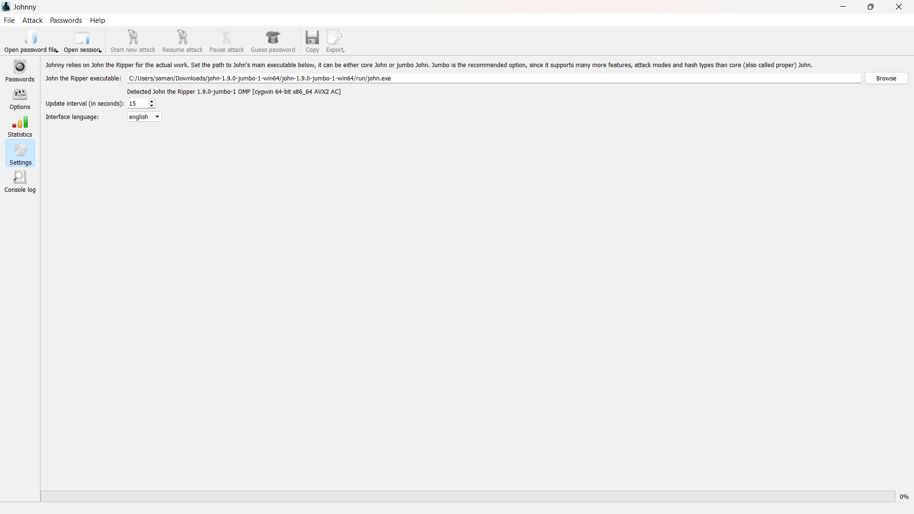
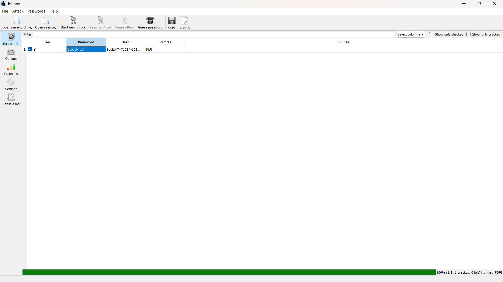
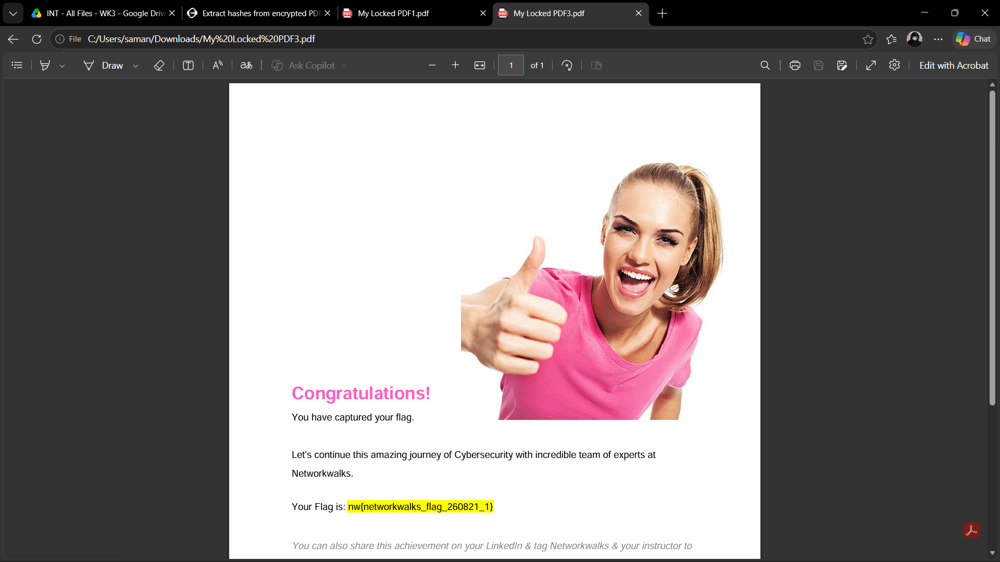
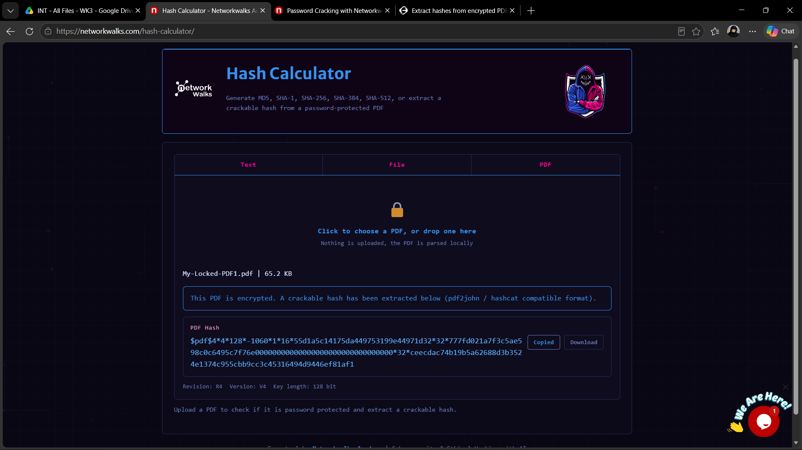
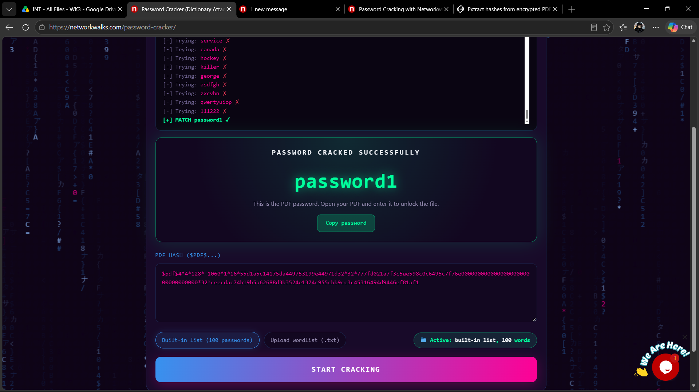

# Week 3 — Password Cracking with JTR & NetworkWalks Tools

Week 3 of my Cybersecurity & Ethical Hacking internship with NetworkWalks moved from information gathering into actually cracking something. Both modules this week work on the same idea from two different angles: a locked PDF is handed to you, you pull a crackable hash out of it, then you throw a wordlist at that hash until something matches.

Two modules, both required:

- **PM1** — cracking a locked PDF using John the Ripper (JTR) and its GUI front-end, Johnny.
- **PM2** — cracking a locked PDF using NetworkWalks' own browser-based Hash Calculator and Password Cracker tools, no install required.

**Author:** Sayan Samanta
**Batch:** B083, NetworkWalks

Same scope note as always — everything here is a locked PDF deliberately provided by NetworkWalks for this exercise. No real files, systems, or third parties are involved.

---

## Why this matters

Before this week, "password cracking" was kind of an abstract phrase to me. Doing it made the concept concrete: a password-protected PDF doesn't store your actual password anywhere, it stores a hash of it. Hashing only goes one direction, so there's no way to "decrypt" a hash back into the password — instead, a cracking tool just generates guesses, hashes each one the same way the file does, and checks for a match. If your password is in a wordlist of 100 common passwords, it gets found in seconds. If it isn't, the tool has to brute-force or move to a smarter wordlist. This is exactly why short, common, or dictionary-word passwords are so weak in practice — the attacker doesn't need to be clever, they just need a decent wordlist.

---

## PM1 — Cracking a PDF with JTR + Johnny

### Setup

Downloaded John the Ripper (jumbo build) and Johnny, the GUI for it, from Openwall. Opened Johnny, went to Settings, and pointed it at `john.exe` inside the extracted JTR folder:

```
C:/Users/saman/Downloads/john-1.9.0-jumbo-1-win64/john-1.9.0-jumbo-1-win64/run/john.exe
```

Johnny picked it up fine and confirmed the version:

```
Detected John the Ripper 1.9.0-jumbo-1 OMP [cygwin 64-bit x86_64 AVX2 AC]
```



### Extracting the hash

The lab instructions suggest `onlinehashcrack.com`'s PDF hash extractor to pull a pdf2john-compatible hash out of the locked PDF. I used a different site instead — **hashes.com's pdf2john tool** (`https://hashes.com/en/johntheripper/pdf2john`) — which does the same job: upload the locked PDF, it gives back a hash starting with `$pdf$...` that John/Johnny can work with. Functionally identical output, just a different front-end for the same pdf2john conversion.

### Cracking it

Saved the hash into a text file, opened it in Johnny via "Open password file", and hit "Start new attack". Johnny ran through its attack modes and landed on a match:

```
Password: good-luck
Hash:     $pdf$4*4*128*-102...
Format:   PDF
100% (1/1: 1 cracked, 0 left)
```



Opened the locked PDF with `good-luck` as the password and got the flag for this module:

```
nw{networkwalks_flag_260821_1}
```



---

## PM2 — Cracking a PDF with NetworkWalks' Hash Calculator & Password Cracker

This module does the exact same job as PM1, but entirely in the browser — no JTR install, no Johnny, just two web tools.

### Step 1 — Extract the hash

Uploaded the locked PDF to NetworkWalks' **Hash Calculator** (`networkwalks.com/hash-calculator/`). It parses the PDF locally in the browser and, since the file is encrypted, immediately returns a pdf2john/hashcat-compatible hash:

```
$pdf$4*4*128*-1060*1*16*55d1a5c14175da449753199e44971d32*32*777fd021a7f3c5ae598c0c6495c7f76e00000000000000000000000000000000*32*ceecdac74b19b5a62688d3b3524e1374c955cbb9cc3c45316494d9446ef81af1
```



### Step 2 — Crack it

Pasted that hash into the **Password Cracker** tool (`networkwalks.com/password-cracker/`), left it on the built-in 100-password list, and hit Start. It ran through the list live in the browser and found a match:

```
[-] Trying: service       X
[-] Trying: canada        X
[-] Trying: hockey        X
[-] Trying: killer        X
[-] Trying: george        X
[-] Trying: asdfgh        X
[-] Trying: zxcvbn        X
[-] Trying: qwertyuiop    X
[-] Trying: 111222        X
[+] MATCH password1       /

PASSWORD CRACKED SUCCESSFULLY: password1
```



### Step 3 — Open the PDF

Entered `password1` into the locked PDF and got this module's flag:

```
nw{networkwalks_flag1_jtr_270521_1}
```


---

## A quick note on the two different PDFs

If you compare the hashes above, you'll notice PM1 and PM2 actually cracked two different files — one came back as `My Locked PDF3.pdf` with password `good-luck`, the other as `My-Locked-PDF1.pdf` with password `password1`. The lab page generates a fresh locked PDF with a random password each time you hit download, so getting a different file and a different flag on separate attempts is expected behavior, not a mistake. The process is identical either way — only the specific hash and password change.

---

## What I actually took away from this week

- **Hashing is one-way, encryption is two-way.** A hash can't be "decrypted" — cracking is really just generating guesses fast enough and checking each one, not reversing anything.
- **Dictionary attacks are only as good as the wordlist.** Both tools cracked their target almost instantly because the password happened to be a common/dictionary word. A genuinely random 12+ character password would have made either tool grind for a very long time, if it finished at all on a small wordlist.
- **The GUI tool and the browser tool are doing the same underlying work.** Johnny is just a front-end over John the Ripper; NetworkWalks' Password Cracker is clearly running the same kind of dictionary-match logic, just client-side in JavaScript instead of a compiled binary. Different packaging, same core idea.
- **There's more than one way to get to pdf2john.** The lab pointed at onlinehashcrack.com, but hashes.com's pdf2john tool produced an equally usable `$pdf$...` hash. Worth knowing there are multiple services doing this exact conversion, so if one is down or slow, there's a fallback.
- **This is genuinely the argument for password managers and long passphrases.** Watching a common password get found in under a couple of seconds against a 100-word list is a much more convincing argument than just being told "use a strong password."

---

## Tools used

- John the Ripper (jumbo build, 1.9.0) + Johnny GUI — https://www.openwall.com/john/ / https://openwall.info/wiki/john/johnny
- hashes.com pdf2john tool — https://hashes.com/en/johntheripper/pdf2john
- NetworkWalks Hash Calculator — https://networkwalks.com/hash-calculator/
- NetworkWalks Password Cracker — https://networkwalks.com/password-cracker/

---

**Sayan Samanta** — Batch B083, NetworkWalks Cybersecurity Program
